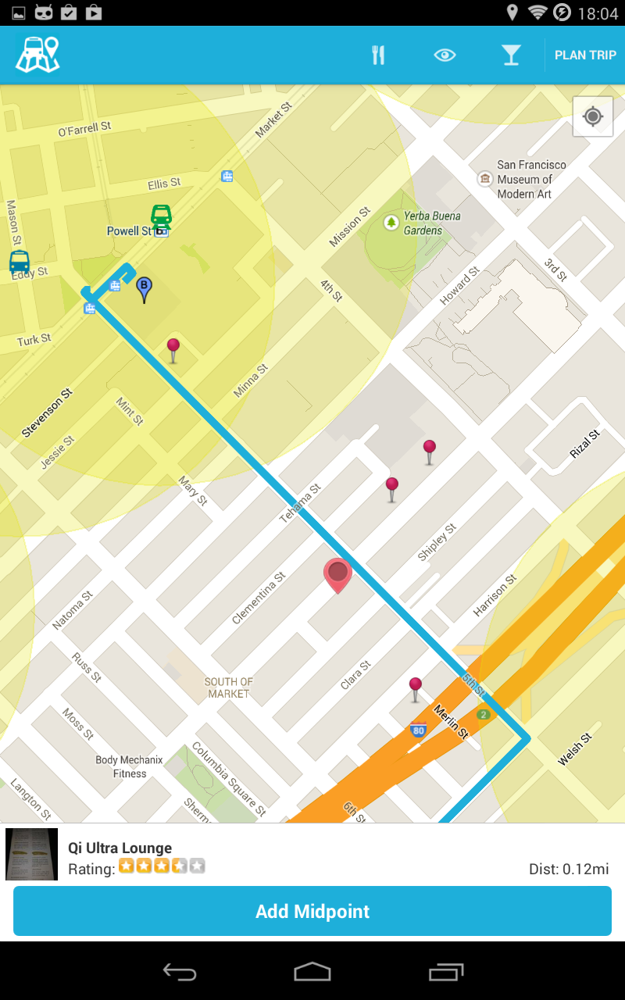
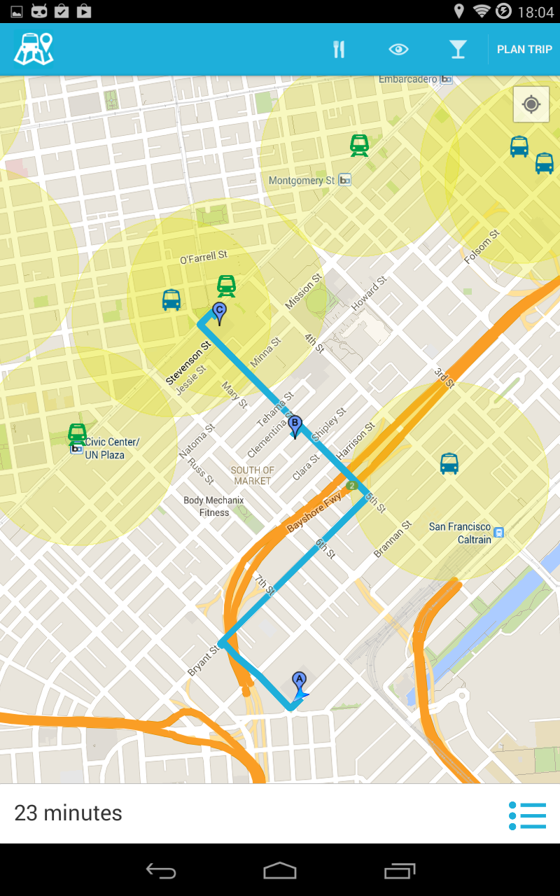

#Route-About App
"Where do you want to go?"

# Overview
Android Mobile App for assisting in planning a quick trip in a city where you're unfamiliar with.
Instead of switching between apps to find places and good review along the way to your destination,
this app will reduce those frictions user have experienced.

 

# User stories
- User can customize a final destination.
- User can pick a quick destination based on a suggestion (i.e. food, restaurants, night clubs...).
- User can add a new location along the current trip by just press & hold on the map.
- User can see a list of recommended places with rating and distance from the current starting location.

# Authors and contributors (Developed by)
- [Nate Kemavaha](https://github.com/boyserk84) 
- [Nina Guo](https://github.com/nguo) 
- [Jeffrey Good](https://github.com/jdgood)

The following libraries are used to make this possible:
* [scribe-java](https://github.com/fernandezpablo85/scribe-java) - Simple OAuth library for handling the authentication flow.
* [Piccaso](https://github.com/square/picasso) - A powerful image downloading and caching library for Android
* [Google Map SDK](https://developers.google.com/maps/documentation/android/) - Google Maps Android API v2
* [Simple Yelp API](https://github.com/boyserk84/AndroidMobile_YelpApi_v2) - Simple Yelp API version 2 for Android Platform.

# We'd like to thank the following people:
- [Nathan Esquenazi](https://github.com/nesquena) Codepath | providing intensive Android training class
- [Matt Luedke](https://github.com/mluedke2) Mentor for this Android project
